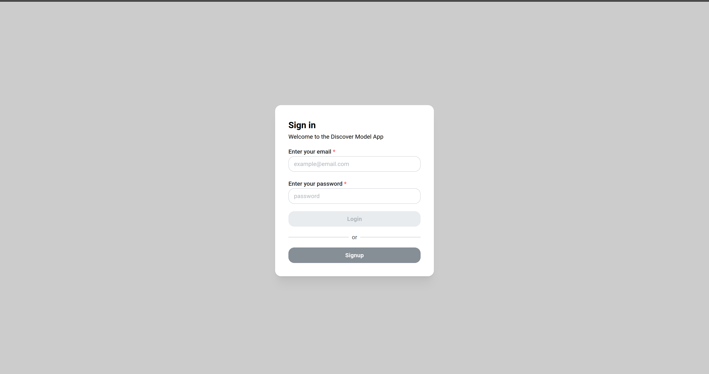
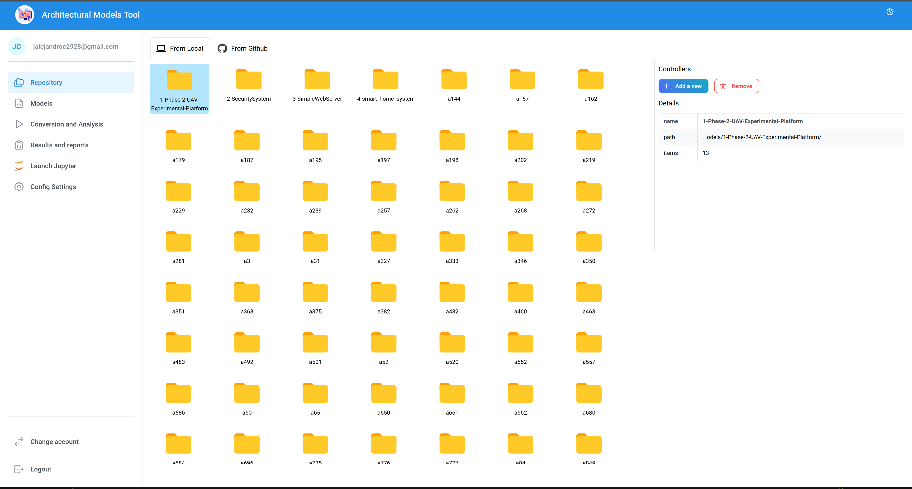
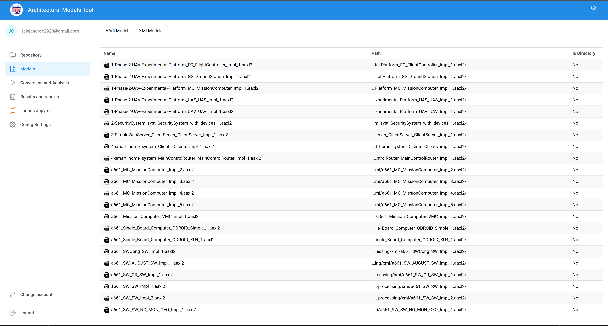
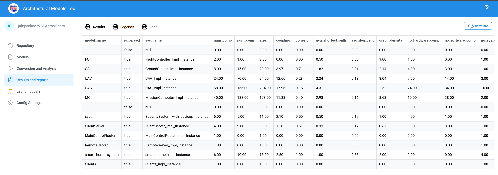

# UI WEB: architectural Model Tool

- [UI WEB: architectural Model Tool](#ui-web-architectural-model-tool)
  - [Login](#login)
  - [Repository](#repository)
  - [Models](#models)
  - [Conversion and Analysis](#conversion-and-analysis)
  - [Results and Reports](#results-and-reports)
  - [Embed Jupyter](#embed-jupyter)
  - [Config](#config)

## Login

## Repository

## Models

## Conversion and Analysis

## Results and Reports

## Embed Jupyter

## Config

